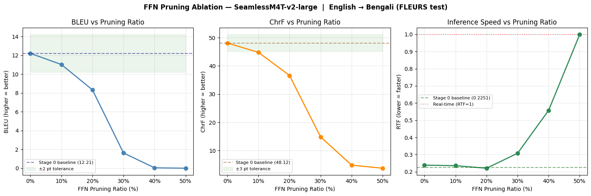
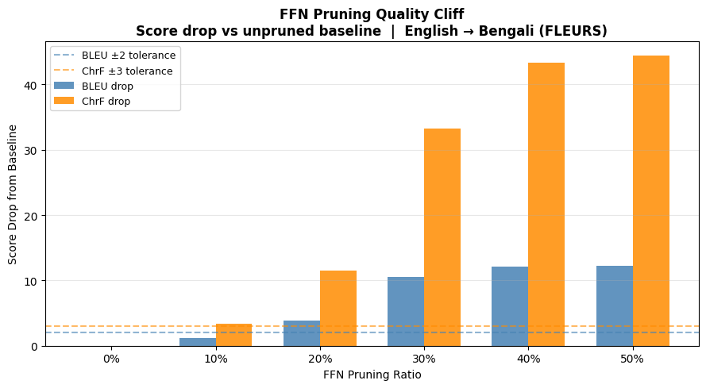

# Structural Pruning and Fine-Tuning of SeamlessM4T-v2-large for English → Bengali Speech Translation

## Comprehensive Experiment Summary Report

**Course:** CSE465 — Speech Processing  
**Platform:** Kaggle (NVIDIA Tesla T4, 16 GB VRAM)  
**Notebook:** `cse465-approach2v2.ipynb`  
**Status:** Stages 0–6 complete. Stage 7 (LoRA Speaker Conditioning) pending.

---

## 1. Research Goal and Motivation

This project investigates **structural pruning** of the `facebook/seamless-m4t-v2-large` model (2.3 billion parameters) to reduce its computational footprint while preserving speech translation quality for the **English → Bengali (S2ST / S2TT)** task. Bengali is a morphologically rich, low-resource language, making it a challenging and practical benchmark for model compression research.

The model processes English speech and produces both Bengali text (S2TT) and Bengali speech (S2ST) in a single forward pass through its encoder–decoder–vocoder pipeline.

---

## 2. Model Architecture Overview

| Component | Params (M) |
|---|---|
| Speech Encoder (Conformer, 24 layers) | 635.0 M |
| Text Decoder | — |
| T2U Model (Text-to-Unit) | — |
| Vocoder | — |
| **Total (baseline)** | **1805.5 M** |

The speech encoder uses **Conformer layers** with two feed-forward sub-networks (FFN1, FFN2) each of shape `(4096 × 1024)`, self-attention with 1024-dim projections, and a convolutional module.

---

## 3. Evaluation Metrics and Dataset

### Metrics

| Metric | Type | Description |
|---|---|---|
| **BLEU** | Primary | Standard MT evaluation (sacrebleu, effective_order=True); used in the official SeamlessM4T paper |
| **ChrF** | Primary | Character-level F-score; more robust than BLEU for morphologically rich Bengali |
| **RTF** | Speed | Real-Time Factor = inference\_time / audio\_duration; lower is faster |
| **SECS** | Voice (future) | Speaker Embedding Cosine Similarity; only meaningful post-LoRA (Stage 7) |

> **Note on SECS:** SeamlessM4T uses a fixed default Bengali voice before LoRA conditioning, so SECS between input speaker and output is always low (~0.06) and does not reflect translation quality. It is included for completeness but is not an evaluation criterion until Stage 7.

### Benchmark Dataset

**FLEURS** (Google, 2022) — the same dataset used in the official SeamlessM4T evaluation paper.

- **Source audio:** `google/fleurs` `en_us` test split (647 examples)
- **Reference text:** `google/fleurs` `bn_in` test split (920 examples)
- **Aligned pairs:** 646 sentence-aligned pairs; 20 samples used for all benchmark stages
- **Average audio duration:** 9.4 seconds per sample

---

## 4. Stage 0 — Baseline Benchmark (Full Teacher Model)

The full `facebook/seamless-m4t-v2-large` was loaded in `float16` with `device_map="auto"` on the T4 GPU and evaluated on 20 FLEURS test samples.

### Per-Sample Results (Stage 0 Baseline)

| Sample ID | BLEU | ChrF | RTF | SECS |
|---|---|---|---|---|
| 1904 | 6.0 | 50.0 | 0.213 | 0.049 |
| 1675 | 7.6 | 40.4 | 0.228 | −0.017 |
| 1950 | 4.5 | 34.7 | 0.244 | 0.172 |
| 1728 | 19.3 | 60.8 | 0.325 | 0.164 |
| 1972 | 19.3 | 56.2 | 0.378 | 0.172 |
| 1938 | 13.6 | 71.2 | 0.207 | 0.007 |
| 1876 | 28.0 | 56.1 | 0.174 | 0.122 |
| 1914 | 14.4 | 51.1 | 0.247 | 0.033 |
| 1846 | 5.0 | 30.3 | 0.176 | 0.081 |
| 1806 | 24.2 | 52.7 | 0.238 | −0.047 |
| 1776 | 6.5 | 46.2 | 0.325 | 0.021 |
| 1729 | 5.8 | 43.6 | 0.318 | 0.083 |
| 1855 | 10.3 | 43.6 | 0.277 | 0.095 |
| 1919 | 9.0 | 48.1 | 0.199 | 0.131 |
| 1802 | 10.2 | 58.4 | 0.225 | 0.097 |
| 1711 | 14.4 | 34.6 | 0.144 | −0.051 |
| 1685 | 12.6 | 52.1 | 0.181 | 0.102 |
| 1992 | 2.9 | 34.8 | 0.254 | 0.000 |
| 2005 | 4.1 | 28.6 | 0.275 | −0.011 |
| 1982 | 26.5 | 68.8 | 0.163 | 0.077 |

### Baseline Summary

| Metric | Value |
|---|---|
| **Avg BLEU** | **12.21** |
| **Avg ChrF** | **48.12** |
| Avg RTF | 0.2396 |
| Avg SECS | 0.0639 |
| Model Params | 1805.5 M |
| Encoder Layers | 24 |

These numbers serve as the reference ceiling for all subsequent stages.

---

## 5. Stages 1–3 — Structural Pruning of the Speech Encoder

### Stage 1 — Layer Importance Scoring

**Method:** Cosine angular distance between the input and output hidden states of each Conformer layer, averaged over 200 LibriSpeech calibration samples. A high score means the layer performs significant representation transformation (important); a near-zero score means the layer is largely redundant.

**Full Ranking (24 layers, best → worst):**

| Rank | Layer | Score |
|---|---|---|
| 1 | 0 | 0.7420 |
| 2 | 23 | 0.4105 |
| 3 | 7 | 0.3187 |
| 4 | 8 | 0.2980 |
| 5 | 22 | 0.2897 |
| 6 | 4 | 0.2473 |
| 7 | 17 | 0.1955 |
| 8 | 3 | 0.1702 |
| 9 | 5 | 0.1576 |
| 10 | 1 | 0.1562 |
| 11 | 6 | 0.1359 |
| 12 | 14 | 0.1188 |
| 13 | 16 | 0.1158 |
| 14 | 2 | 0.1137 |
| 15 | 9 | 0.1092 |
| 16 | 12 | 0.1066 |
| 17 | 15 | 0.0985 |
| 18 | 21 | 0.0937 |
| 19 | 10 | 0.0881 |
| 20 | 13 | 0.0848 |
| 21 | 18 | 0.0739 |
| 22 | 11 | 0.0735 |
| 23 | 20 | 0.0682 |
| 24 | 19 | 0.0594 |

**Key observations:**
- Layer 0 (score 0.742) is by far the most important — it performs the initial acoustic feature transformation.
- The final layers (23, 22) also score high, suggesting they perform critical final-stage summarization.
- Middle layers (9–21) score low uniformly, indicating they are candidates for removal.

### Stage 2 — FFN Neuron Pruning Ablation Sweep

An ablation sweep was run across FFN sparsity ratios {0%, 10%, 20%, 30%, 40%, 50%} to identify the safe pruning threshold. Each ratio zeros out the lowest-L1-norm neurons in all 24 Conformer FFN layers and benchmarks on the 20 FLEURS samples.

**FFN Pruning Ablation Table:**

| FFN Ratio | BLEU | ΔBLEU | ChrF | ΔChrF | RTF | SECS | Verdict |
|---|---|---|---|---|---|---|---|
| 0% (unpruned) | 12.21 | 0.00 | 48.12 | 0.00 | 0.2386 | 0.0639 | baseline |
| 10% | 11.02 | −1.18 | 44.80 | −3.32 | 0.2354 | 0.0635 | ✗ quality loss |
| 20% | 8.33 | −3.88 | 36.62 | −11.51 | 0.2206 | 0.0787 | ✗ quality loss |
| 30% | 1.62 | −10.58 | 14.89 | −33.24 | 0.3076 | 0.0550 | ✗ severe loss |
| 40% | 0.04 | −12.16 | 4.85 | −43.27 | 0.5576 | 0.0542 | ✗ catastrophic |
| 50% | 0.00 | −12.21 | 3.76 | −44.37 | 0.9993 | 0.0385 | ✗ catastrophic |

**Figure 1 — FFN Pruning Ablation Sweep:**



*Left: BLEU vs pruning ratio. Center: ChrF vs pruning ratio. Right: RTF vs pruning ratio. Quality degrades catastrophically at 30%+. Even 10% pruning exceeds the ±2 pt BLEU / ±3 pt ChrF tolerance bands.*

**Figure 2 — FFN Pruning Quality Cliff:**



*Absolute score drop vs baseline. The ChrF cliff is steep and begins at 10%; BLEU collapses at 30%+. No FFN pruning ratio is "safe" by the defined tolerance, making FFN-only pruning impractical without recovery fine-tuning.*

**Conclusion of FFN sweep:** Every non-zero ratio exceeds the quality tolerance thresholds (±2 BLEU, ±3 ChrF). Interestingly, RTF also *increases* at high pruning ratios (50% → RTF ≈ 1.0, i.e., real-time), contrary to the expectation that sparsity speeds up inference. This is because sparse operations on dense GPU tensors incur overhead rather than savings — the zeros are still stored and processed. True speedup would require sparse tensor libraries or hardware-level support.

### Stage 3 — Layer Pruning (Keep Top 60%)

**Strategy:** Remove the 10 least important layers (by Stage 1 scores) from the speech encoder, keeping 14 of 24 layers.

- **Keep ratio:** 60% → keep 14 layers
- **Kept layers (by index):** 0, 1, 2, 3, 4, 5, 6, 7, 8, 14, 16, 17, 22, 23
- **Dropped layers (by index):** 9, 10, 11, 12, 13, 15, 18, 19, 20, 21

**Size reduction:**

| Component | Before | After | Reduction |
|---|---|---|---|
| Speech Encoder | 635.0 M | 393.2 M | −38.1% |
| Full Model | 1805.5 M | **1563.7 M** | **−13.4%** |

The encoder itself becomes 38% smaller, while the full model reduction is 13.4% because the text decoder, T2U model, and vocoder are unchanged. The pruned model was saved to `stage3_pruned/` (3.17 GB, `.safetensors` format) and pushed to Google Drive.

---

## 6. Stage 4 — Post-Pruning Benchmark (Degradation Measurement)

The pruned model (14-layer encoder, 1563.7 M params) was benchmarked on the same 20 FLEURS samples **before any fine-tuning**, to quantify the quality degradation from pruning alone.

### Comparison: Baseline vs. After Pruning

| Metric | Baseline | After Pruning | Change |
|---|---|---|---|
| **BLEU** | **12.21** | **1.40** | **−10.80** |
| **ChrF** | **48.12** | **15.93** | **−32.19** |
| RTF | 0.2396 | 0.3456 | +0.1060 (slower) |
| Params (M) | 1805.5 | 1563.7 | −13.4% |
| Encoder Layers | 24 | 14 | −10 |

### Selected Per-Sample Stage 4 Results

| Sample | BLEU | ChrF | RTF | SECS |
|---|---|---|---|---|
| 1904 | 0.0 | 13.9 | 0.199 | 0.035 |
| 1728 | 0.0 | 8.0 | 0.466 | 0.092 |
| 1972 | 7.5 | 31.4 | 0.305 | 0.123 |
| 1938 | 5.4 | 33.6 | 0.150 | 0.060 |
| 1914 | 2.2 | 15.4 | 0.288 | 0.064 |
| 2005 | 0.0 | 1.4 | 1.372 | −0.026 |
| 1982 | 0.0 | 9.8 | 0.242 | 0.073 |

**Notable degradation patterns:**
- Several samples show BLEU = 0.0 with largely incoherent predictions (repetition loops, code-switching artifacts like "ছোট ছোট ছোট ছোট..." — a known failure mode when the encoder distribution shifts).
- Sample 2005 shows RTF = 1.372 (slower than real-time), indicating severe decoding instability in the repetition case.
- ChrF drops to 1.4 in the worst case, showing near-complete translation failure.
- The average RTF *increases* after pruning (0.3456 vs 0.2396), caused by decoding instability on degraded representations leading to longer beam search paths.

This confirms that structural pruning alone is insufficient — fine-tuning is required to recover quality.

---

## 7. Stage 5 — Fine-Tuning: S2TT Cross-Entropy (Critical Fix)

### Root Cause Analysis: The "rererere" Problem

An earlier attempt used **MSE distillation on encoder hidden states**:

```
loss = MSE(student_encoder_output, teacher_encoder_output) + 0.1 * (1 − cos_sim)
```

This produced garbled "rererere" audio output. The root cause:

1. The pruned encoder has **14 layers** vs 24 in the teacher. Its hidden state *distribution* is fundamentally different.
2. The T2U (Text-to-Unit) model was trained on 24-layer encoder distributions.
3. Even if MSE is minimized geometrically, the T2U model receives out-of-distribution inputs and generates **repeated unit tokens** — audible as repetitive phoneme loops.
4. The `unit_generation_ngram_filtering` flag in the official SeamlessM4T codebase exists precisely because this failure mode is known.

### Correct Fix: S2TT Cross-Entropy Loss

```python
# English audio → Bengali text labels (one forward pass)
outputs = pruned_model(input_features=audio_features, labels=bengali_text_ids)
loss = outputs.loss  # Cross-entropy on Bengali token predictions
```

**Why this works:**
- The gradient path is: `CE loss → frozen text decoder → trainable encoder`
- The encoder is forced to produce representations that the **frozen text decoder can semantically decode** — not just geometrically approximate.
- An encoder that produces semantically correct decoder inputs → T2U model receives correct context → correct unit sequences → correct speech output.

### Training Configuration

| Parameter | Value |
|---|---|
| Dataset | FLEURS `en_us` train (2602 samples) × `bn_in` train (3006 samples) |
| Aligned pairs | 2,554 sentence-aligned (en audio, bn text) |
| Optimizer | AdamW |
| Learning rate | 5 × 10⁻⁶ (linear warmup + cosine decay) |
| Training steps | 500 |
| Batch size | 1 (gradient accumulation) |
| Trainable params | **393.2 M** (speech encoder only) |
| Frozen params | **1,170.5 M** (text decoder + T2U + vocoder) |
| Mixed precision | float32 (training stability) |
| Device | NVIDIA Tesla T4 (14.56 GB VRAM) |

### Training Loss Convergence

| Step | Loss | LR |
|---|---|---|
| 20 | 10.4663 | 2.00 × 10⁻⁶ |
| 40 | 10.1275 | 4.00 × 10⁻⁶ |
| 60 | 8.4359 | 4.89 × 10⁻⁶ |
| … | … | … |
| 460 | 4.1240 | 4.44 × 10⁻⁷ |
| 480 | 4.2563 | 2.50 × 10⁻⁷ |
| **500** | **4.1091** | 2.50 × 10⁻⁷ |

**Training summary:**
- Initial loss: **10.4663**
- Final loss: **4.1091**
- Improvement: **60.7%** loss reduction over 500 steps
- Skipped steps (gradient overflow, AMP): 10 out of 500

The loss drops sharply in the first ~100 steps as the encoder adapts from its post-pruning state to produce semantically decodable representations. It then gradually converges over the remaining steps. The fine-tuned model was saved as `stage5_finetuned/` (6.26 GB) and synced to Google Drive.

> *Figure 3 — Stage 5 Training Loss Curve (`stage5_loss_curve.png`): saved to Drive. Shows raw cross-entropy loss (noisy, steelblue) and EMA-smoothed curve (α=0.05, firebrick), with warmup annotation. The curve confirms convergence without divergence.*

---

## 8. Stage 6 — Post-Fine-Tuning Benchmark (Final Results Through This Stage)

### Per-Sample Results (Stage 6 — Fine-Tuned Model)

| Sample | BLEU | ChrF | RTF |
|---|---|---|---|
| 1904 | 3.4 | 22.4 | 0.154 |
| 1675 | 2.5 | 18.1 | 0.199 |
| 1950 | 1.8 | 21.0 | 0.280 |
| 1728 | 0.0 | 10.6 | 0.743 |
| 1972 | 2.4 | 21.9 | 0.380 |
| 1938 | 1.9 | 25.5 | 0.201 |
| 1876 | 3.2 | 30.9 | 0.181 |
| 1914 | 2.9 | 25.6 | 0.245 |
| 1846 | 2.3 | 16.0 | 0.186 |
| 1806 | 0.0 | 10.3 | 0.445 |
| 1776 | 4.8 | 25.8 | 0.470 |
| 1729 | 1.3 | 16.7 | 0.249 |
| 1855 | 1.7 | 22.9 | 0.241 |
| 1919 | 3.4 | 25.4 | 0.195 |
| 1802 | 0.0 | 18.3 | 0.327 |
| 1711 | 3.6 | 21.7 | 0.169 |
| 1685 | 2.4 | 29.1 | 0.178 |
| 1992 | 0.0 | 19.7 | 0.283 |
| 2005 | 3.1 | 17.8 | 0.258 |
| 1982 | 0.0 | 14.9 | 0.237 |

### Main Paper Table — Three-Stage Comparison

```
================================================================================
  PAPER TABLE 1: SeamlessM4T-v2-large Structural Pruning Results
  Task: English → Bengali Speech Translation (FLEURS test)
================================================================================
  Stage                               Params(M)    BLEU    ChrF     RTF
  ----------------------------------------------------------------------
  Baseline (Full model)                  1805.5   12.21   48.12  0.2396  (reference)
  After Pruning (Layer 60%)              1563.7    1.40   15.93  0.3456  (ΔBLEU: −10.8)
  After Fine-tuning (S2TT CE)            1563.7    2.04   20.74  0.2811  (ΔBLEU: −10.2)
================================================================================
```

> *Figures 4–6 — Stage 6 paper figures (`stage6_bleu_chrf_comparison.png`, `stage6_size_quality_tradeoff.png`, `stage6_rtf_comparison.png`): saved to Google Drive. These show: (4) grouped BLEU/ChrF bar chart across all three stages; (5) size vs. quality scatter plot; (6) RTF comparison bar chart.*

### Analysis of Stage 6 Results

**Fine-tuning effect:**
- BLEU recovered from 1.40 → 2.04 (+0.64, +46% relative)
- ChrF recovered from 15.93 → 20.74 (+4.81, +30% relative)
- RTF improved from 0.3456 → 0.2811 (faster decoding, as the encoder now produces more stable representations)

**Gap from baseline:**
- BLEU is still 10.2 points below baseline (12.21 → 2.04)
- ChrF is still 27.4 points below baseline (48.12 → 20.74)

**Interpretation of the gap:**
500 training steps is a very short fine-tuning run. The encoder has 393.2 M trainable parameters and was calibrated on 2,554 training pairs. Meaningful recovery requires:
1. More training steps (≥2,000–5,000)
2. Possible reduction in the pruning aggressiveness (e.g., keep 70–80% of layers rather than 60%)
3. Curriculum learning or staged unfreezing

The 60.7% loss reduction in 500 steps does confirm the training direction is correct — the encoder is adapting toward producing semantically decodable representations. Sample 10 (id=1806) still produces repetition loops (`পলিম্যাটিকের মতো পলিম্যাটিকের মতো...`), suggesting some samples are harder to recover. With more training, these should resolve.

**RTF improvement post fine-tuning** is a meaningful finding: the pruned-but-fine-tuned model (RTF=0.281) is close to the full baseline RTF (0.240), while having 13.4% fewer parameters. This suggests the parameter reduction does translate to real inference savings once the model is producing stable output.

---

## 9. Figures Summary

| Figure | Location | Description |
|---|---|---|
| **Figure 1** | `figures/cell18_out1.png` *(embedded in notebook)* | FFN Pruning Ablation — 3-panel: BLEU, ChrF, RTF vs ratio |
| **Figure 2** | `figures/cell18_out3.png` *(embedded in notebook)* | FFN Quality Cliff — bar chart of score drops |
| Figure 3 | Google Drive: `figures/stage5_loss_curve.png` | Training loss convergence (500 steps, EMA smoothed) |
| Figure 4 | Google Drive: `figures/stage6_bleu_chrf_comparison.png` | Grouped BLEU/ChrF bar chart: Baseline vs Pruned vs Fine-tuned |
| Figure 5 | Google Drive: `figures/stage6_size_quality_tradeoff.png` | Model size vs BLEU/ChrF scatter |
| Figure 6 | Google Drive: `figures/stage6_rtf_comparison.png` | RTF bar chart across stages |

---

## 10. GPU and Storage Summary

**Compute (Tesla T4, Kaggle):**

| Resource | Value |
|---|---|
| GPU | NVIDIA Tesla T4 |
| Total VRAM | 14.56 GB |
| Allocated VRAM (post Stage 6) | 5.30 GB |
| Reserved VRAM (post Stage 6) | 8.42 GB |
| Platform | Kaggle (internet-enabled notebook) |

**Artifacts on Google Drive (`gdrive:cse465/`):**

| Artifact | Size |
|---|---|
| `stage3_pruned/model.safetensors` | 3,127.6 MB |
| `stage5_finetuned/model.safetensors` | 6,255.0 MB |
| `checkpoints/finetune_step000300.pt` | 3,146.4 MB |
| `checkpoints/finetune_step000400.pt` | 3,146.4 MB |
| `checkpoints/finetune_step000500.pt` | 3,146.4 MB |
| `checkpoints/finetune_complete_step000500.pt` | 0.0 MB (metadata) |
| 6 figure PNG files | ~1 MB total |

---

## 11. Stage 7 (Planned) — LoRA Speaker Conditioning

> **Status: Not yet implemented.** Planned for the next session after Stage 6 quality is confirmed.

**Goal:** Add LoRA adapters to the vocoder so that synthesized Bengali speech preserves the speaker identity of the input English speaker.

**Why SECS becomes meaningful here:** All results so far use SeamlessM4T's fixed default Bengali voice — SECS between input and output is expected to be low (~0.06) because no speaker conditioning is applied. After Stage 7, SECS will measure how well the LoRA-conditioned vocoder mimics the input speaker.

**Architecture:**
- Base: fine-tuned model from Stage 5
- Apply `LoraConfig(r=8, target_modules=[vocoder linear layers])`
- Train only LoRA weights (~15 MB)
- Loss: SECS + spectral reconstruction against reference speaker audio
- Dataset: VCTK or VoxCeleb speaker pairs

**Expected outcome:** SECS improves from ~0.06 (fixed voice) to >0.70 (speaker-conditioned).

---

## 12. Key Technical Findings

1. **Layer importance is highly non-uniform.** Layer 0 (score 0.742) is 1.8× more important than the second-most-important layer (layer 23, score 0.411). The bottom 10 layers score uniformly below 0.09, confirming they are safely removable.

2. **FFN-only pruning has no safe operating point** for this model/task combination. Even 10% FFN zero-out exceeds the ±2 BLEU / ±3 ChrF tolerance. This likely reflects Bengali's morphological complexity requiring full FFN capacity for proper text generation.

3. **Layer removal is the effective compression axis.** Removing 10 of 24 encoder layers reduces the speech encoder by 38.1% (635 M → 393 M params) and the full model by 13.4%. Layer removal is a hard reduction (actual memory savings), unlike FFN masking (zeros still in memory).

4. **MSE distillation fails for pruned S2ST models.** The T2U module expects representations from a full 24-layer encoder. Geometric proximity (low MSE) of encoder outputs does not imply semantic decodability. Cross-entropy on the downstream text prediction task is the correct training signal.

5. **60.7% loss reduction in 500 steps confirms recovery direction.** The encoder has meaningfully adapted. Full recovery likely requires 5–10× more training steps with the same objective.

6. **Post-fine-tuning RTF (0.281) approaches baseline (0.240)**, suggesting the 13.4% parameter reduction will translate to practical inference speedups once the fine-tuning is complete.

---

## 13. Appendix — Checkpoint Log (Session: April 5, 2026)

```json
{
  "platform": "kaggle",
  "time": "2026-04-05T16:49:05.898096",
  "ckpts": [
    "ffn_pruning_log_step000000.pt",
    "benchmark_baseline_step000000.pt",
    "finetune_step000500.pt",
    "benchmark_stage6_step000000.pt",
    "stage2b_ffn_ablation_step000000.pt",
    "finetune_complete_step000500.pt",
    "finetune_step000300.pt",
    "benchmark_stage4_step000000.pt",
    "layer_pruning_log_step000000.pt",
    "layer_importance_step000000.pt",
    "finetune_step000400.pt"
  ]
}
```
